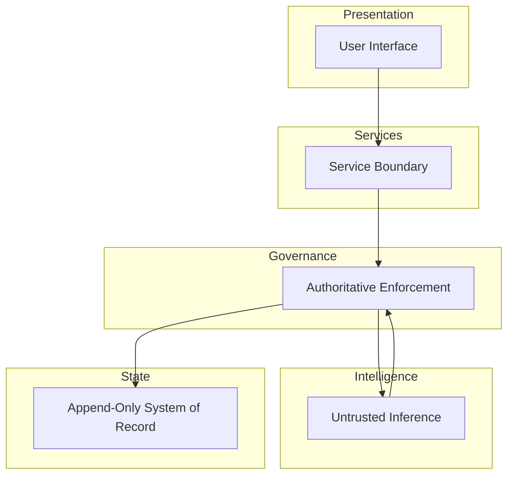

# SalesFlow AI

**A governance-first decision system where AI proposes, but code enforces.**

- Decisions are immutable once approved
- Traces are append-only during execution
- Replay produces identical output regardless of when it runs
- Human authority cannot be delegated to inference

**Threat model:** Assume the LLM hallucinates, timestamps drift, humans disagree, and audits happen months later.

---

## Why This Exists

Most AI systems implicitly trust inference. This one is designed around the assumption that inference will eventually be wrong, challenged, or legally questioned.

| Typical AI Systems                          | This System                                                 |
| ------------------------------------------- | ----------------------------------------------------------- |
| Decisions exist only in logs                | Decisions are enforced, versioned, and auditable            |
| Output correctness depends on prompt tuning | Output correctness depends on structural invariants         |
| Replay means "run it again"                 | Replay means "produce identical results, deterministically" |
| Human oversight is optional UI              | Human override is irreversible state transition             |
| Audit trail is an afterthought              | Audit trail is the system                                   |

This architecture assumes the LLM will be wrong. The question is whether the system fails safely when it is.

---

## Architecture



The governance plane sits between services and intelligence. All inference output passes through enforcement before reaching state. There is no direct path from intelligence to persistence.

---

## Why This Is Hard

This system operates under constraints that most applications avoid:

- **Temporal invariance**: A decision replayed six months later must produce byte-identical output.
- **Authority separation**: The LLM may propose severity, but code determines it. The LLM may draft messages, but policy gates them.
- **Irreversible overrides**: When a human rejects a recommendation, that rejection cannot be undone—not by the system, not by another human, not by re-running the workflow.
- **Write-only traces**: During execution, trace data can only be appended. Modification requires a new execution.
- **Frozen evaluation**: Replay uses the timestamp of the original execution, not wall-clock time. Rules that were active then are evaluated, not rules active now.

These constraints are not features. They are load-bearing walls.

---

## Non-Negotiables

This system will intentionally fail rather than violate these constraints:

- Approved decisions must never change
- Rejected recommendations must never reappear
- Replay must never depend on current time
- Governance must never call an LLM
- Inference must never write state directly

---

## Demo vs Real Execution

The system operates in two modes.

**Demo mode** prioritizes determinism and clarity. Outputs are reproducible without external dependencies. The governance layer is fully active.

**Real mode** activates the inference plane and connects to live data sources. The governance layer remains identical.

The difference is in what generates proposals, not in what enforces them.

---

## What This Project Demonstrates

- Systems design under adversarial assumptions
- Governance as architecture, not policy
- Deterministic replay in stateful workflows
- Event sourcing with terminal state semantics
- Failure isolation between inference and authority
- Auditability as a first-class constraint

---

## What This Project Is Not

- Not a chatbot
- Not a CRUD application with an LLM attached
- Not a prompt engineering showcase
- Not optimized for demo impressiveness
- Not a tutorial on LangChain or Streamlit

The interesting parts are not in the UI.

---

## Getting Started

```bash
streamlit run app.py
```

Runs in demo mode by default. Real execution requires explicit configuration.

---

## Design Principles

1. **LLMs are untrusted by default.** They provide signal, not decisions.
2. **Governance is structural.** It cannot be bypassed by changing prompts.
3. **State transitions are explicit.** Every change is a recorded event.
4. **Replay is not re-execution.** It is deterministic reconstruction.
5. **Human override is final.** The system does not second-guess rejection.

---

If this system feels rigid, that is intentional. Flexibility lives in inference. Authority does not.

<p align="center"><em>This repository is designed to be discussed, not skimmed.</em></p>